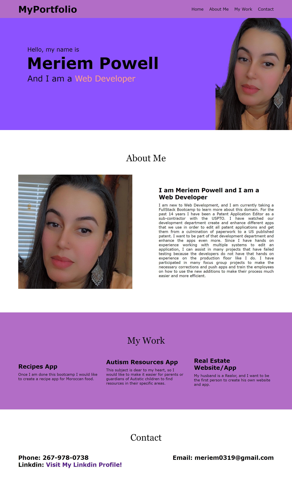

# Meriem's Professional Portfolio

🏗️ This week I am creating a professional portfolio of work that can showcase my skills and talents to employers looking to fill a part-time or full-time position. This is currently a begginer's portfolio and will not have Web Development experience, but after bootcamp, it will highlight my strongest work as well as the thought processes behind it.

## 🎯 Must Use:

* Flexbox, media queries, and CSS variables

## 🪄 User Story

* I WANT to view a potential employee's deployed portfolio of work samples
SO THAT I can review samples of their work and assess whether they're a good candidate for an open position

## 🧩 Acceptance Criteria

* GIVEN I need to sample a potential employee's previous work
* WHEN I load their portfolio
THEN I am presented with the developer's name, a recent photo or avatar, and links to sections about them, their work, and how to contact them
* WHEN I click one of the links in the navigation
THEN the UI scrolls to the corresponding section
* WHEN I click on the link to the section about their work
THEN the UI scrolls to a section with titled images of the developer's applications
* WHEN I am presented with the developer's first application
THEN that application's image should be larger in size than the others
* WHEN I click on the images of the applications
THEN I am taken to that deployed application
* WHEN I resize the page or view the site on various screens and devices
THEN I am presented with a responsive layout that adapts to my viewport

## Screenshot

## 🖥️ Deployment

* Website Link: https://meriem0319.github.io/My-Professional-Portfolio/
* Repository Link: https://github.com/meriem0319/My-Professional-Portfolio

## ✒️ Author
Meriem Powell